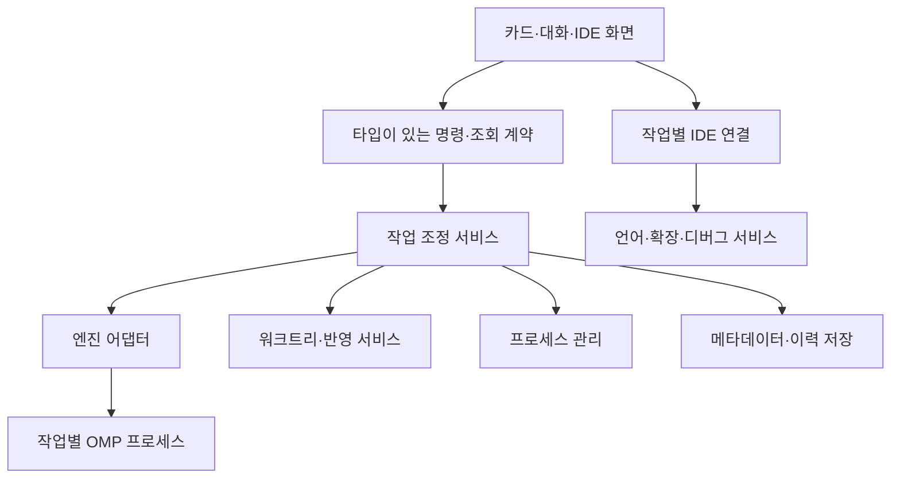

# 02. 기술 선정과 아키텍처 결정서

작성일: 2026-09-23  
기준: [제품 명세](../agent_workspace_spec_v0.1.md)  
연결: [검증 계획](01-technical-validation.md), [요구사항 추적표](03-requirements-traceability.md)

## 1. 결정 상태

이 문서는 실제 구현을 위한 설계 기준이다. '채택'은 이번 문서에서 선택한 구현 방향이며 사용자가 모든 내부 설계에 개별 동의했다는 의미가 아니다. '조건부'는 검증 전 기반 확정 금지, '보류'는 결정 근거가 부족함을 뜻한다. 제품 요구사항을 기술적 편의 때문에 변경하지 않는다.

| ID | 결정 | 상태 | 검증 |
| --- | --- | --- | --- |
| ADR-001 | Theia를 첫 IDE 검증 후보로 사용, 코어 포크보다 구성·확장 우선 | 조건부 | TV-001/002/012 |
| ADR-002 | TypeScript 중심 모듈 구조와 UI/도메인/인프라 분리 | 채택 | 정적 의존성 확인 |
| ADR-003 | OMP 별도 프로세스 RPC 어댑터, 다른 엔진과 계약 분리 | 조건부 | TV-003/004/007 |
| ADR-004 | 화면 선택과 작업 실행·IDE 서비스 수명을 분리 | 채택, 호스트 구현은 조건부 | TV-001/002 |
| ADR-005 | 수정 가능한 후속 지시 대기열은 앱이 소유 | 채택 | TV-005 |
| ADR-006 | 논의 단계 도구 제한과 외부 변경 범위를 실행 경계에서 적용 | 채택, OMP 연결 검증 필요 | TV-006/014 |
| ADR-007 | 단기 실행과 지속 서버의 소유 그룹 분리 | 채택, Windows 구현 검증 필요 | TV-008/013 |
| ADR-008 | 새 워크트리로 기존 세션을 비파괴적으로 이전 | 채택, 세션 API 조건부 | TV-007 |
| ADR-009 | 저장소 단위 반영 직렬화와 반영 저널 | 채택 | TV-009 |
| ADR-010 | 실제 코드 두 뷰와 별도 변경 블록 연결 표시 | 채택 | TV-010 |
| ADR-011 | SQLite 메타데이터, 파일 기반 큰 자료, 증분 이벤트 | 조건부 | TV-011 |
| ADR-012 | 실제 비교 측정 통과 전 메모리 절감 주장 금지 | 채택 | TV-012 |

## 2. 논리 구조와 책임

프로젝트는 저장소와 기본 설정의 단위, 작업은 원래 요청·대화·워크트리의 단위, 에이전트는 작업 안의 실행 주체다. 준비 중 작업에는 논의 세션이 있을 수 있지만 실행용 워크트리는 없다. 작업 시작 때 기존 논의 세션을 안전하게 전환할지 새 실행 세션에 문맥을 넘길지는 TV-007과 어댑터 상세 명세에서 결정한다.

UI는 작업 상태를 임의로 완료 처리하지 않는다. 조정 서비스는 도메인 규칙의 권위자이고 OMP는 실행의 권위자다. 실제 파일 내용은 파일 시스템을 기준으로 하되, 미저장 편집 버퍼와 저장된 검토 스냅샷을 구별한다.

## 3. 결정 상세

### ADR-001 — 기반 IDE

문제: 단순 편집기 기반 앱은 필수 확장·디버깅·언어 기능을 대량으로 다시 구현해야 한다.

결정: Theia로 최소 호스트를 구성해 먼저 검증한다. 채택 후에도 상위 코어 수정 없이 앱 구성과 확장 패키지를 우선 사용한다. Pi Desktop 전체 포크는 필수 IDE 기능과 80% 일치가 입증되지 않아 선택하지 않는다.

대안: Code-OSS 계열 기반은 Theia 검증 실패 시 재평가한다. 자체 경량 셸+편집기는 확장 호스트 구현 부담 때문에 우선순위가 낮다. VS Code 확장은 독립 앱이라는 요구와 맞지 않는다.

결과: 기존 IDE 기능을 활용할 가능성이 높지만 메모리 절감과 다중 워크트리 서비스 유지가 자동으로 해결되지는 않는다. Theia/Electron/Node 버전은 검증 조합으로 고정하며 아직 특정 번호를 승인하지 않는다.

### ADR-002 — 모듈 경계

코어 로직은 IDE SDK나 OMP 메시지 타입을 직접 참조하지 않는다. UI/IDE 연결과 OMP 매핑은 가장자리 어댑터에 둔다. 도메인 ID는 문자열 불투명 식별자로 취급하고 경로·PID를 ID로 사용하지 않는다.

제안 디렉터리:

| 경로 | 책임 |
| --- | --- |
| apps/desktop | 플랫폼 진입·창·종료·패키징 |
| packages/contracts | 내부 명령·이벤트·오류 타입 |
| packages/core | 작업 상태·대기열·정책·반영 조정 |
| packages/engine-omp | OMP 프로세스·RPC·세션 매핑 |
| packages/worktrees | Git 실행·가져오기·반영·정리 |
| packages/processes | 프로세스 소유·터미널·포트 관리 |
| packages/persistence | 스키마·마이그레이션·이벤트 기록 |
| packages/ide-integration | 파일·편집 버퍼·언어·확장·디버거 연결 |
| packages/ui | 카드·대화·검토·알림 |
| docs | 요구사항·검증·설계·증거 |

이는 폴더 계약 제안이며 아직 코드를 생성하지 않았다. 구체적인 API 타입·오류 코드는 후속 API 문서의 단일 정의로 관리한다.

### ADR-003 — OMP 경계

메인 실행 세션별 OMP 프로세스로 시작한다. 한 프로세스에 모든 세션을 넣어 메모리를 줄이는 방식은 장애 격리·SDK 안정성 검증 없이 적용하지 않는다. 하위 에이전트는 별도 메인 작업으로 만들지 않고 엔진 관계를 작업 트리에 반영한다.

공개 RPC 문서에서 확인한 연결 지점은 prompt, steer, abort, get_state, set_subagent_subscription, get_subagents 등이다. 세부 프레임 파서와 완료 판정은 선택 버전의 공식 계약을 따른다. 로그 문자열에서 상태를 추정하지 않는다.

앱 대기열은 ADR-005를 사용한다. 큰 출력은 점진적으로 처리하며 stderr와 stdout 프로토콜을 혼합하지 않는다. 요청 ID는 상관관계용이며 엔진이 중복 실행 방지를 보장한다는 뜻이 아니다.

대안: 필요한 제어가 RPC로 불가능하면 공개 SDK 또는 엔진 확장을 어댑터 내부에서 검토한다. 조용히 기능을 생략하지 않는다.

### ADR-004 — IDE 유지와 전환

선택 작업의 UI만 바꾸고 비선택 작업의 분석·디버그·터미널 상태는 유지한다. 파일 URI와 taskId를 함께 사용하여 다른 워크트리의 같은 상대 경로를 구별한다. 전역 확장 설치와 작업별 실행 문맥은 별개다.

언어 서비스를 한 프로세스로 공유할지 여러 호스트로 나눌지는 확장 지원과 TV-002/012로 결정한다. '모든 워크트리를 한 멀티루트에 넣으면 해결'이라고 가정하지 않는다. workspaceFolder, 상대 경로, 진단, 실행 설정의 문맥이 정확해야 한다.

### ADR-005 — 대기열의 권위자

후속 지시는 우선 앱 DB에 대기 상태로 보관하고, 이전 실행이 완전히 정리된 안전한 시점에 한 항목씩 엔진으로 인계한다. 엔진 내부 큐에 미리 모두 넣고 수정·삭제를 지원하는 척하지 않는다.

상태: queued → dispatching → accepted → finished 또는 failed/unknown. 수정·삭제는 queued 상태에서만 트랜잭션으로 허용한다. dispatching으로 바뀐 항목의 수정은 거절하고 새 즉시 지시로 정정하도록 안내한다. UI에는 이를 '전달 중'으로 명확히 표시한다.

Esc는 자동 대기열 소비를 멈추고 미전달 항목은 보존한다. 사용자가 새 지시로 재개하면 기존 대기 지시가 남아 있음을 표시한다. 재시작 직후에는 대기열을 자동 전송하지 않는다. 즉시 지시는 진행 중 작업에 steer로 전달하되 실제 도구 중단과 혼동하지 않는다.

### ADR-006 — 실행 정책

논의 모드는 도구 허용목록으로 읽기·검색만 허용한다. 셸과 변경 가능한 MCP 도구 등 우회 경로도 같은 정책을 적용한다. 에이전트에게 '수정하지 말라'고 말하는 것만으로 구현 완료가 아니다.

수동 모드는 반영 전 승인, 자동 모드는 워크플로우가 허용하는 범위만 실행한다. 지침 없음 또는 외부 변경 범위 불명확 시 코드 작업은 계속할 수 있지만 병합·push·PR은 대기한다. 명령을 앱에서 통제할 수 있는지 TV-006/014로 검증하며 이를 OS 수준 샌드박스라고 표현하지 않는다.

### ADR-007 — 실행 소유 관계

taskId·processRole·PID·시작 식별자·부모 관계를 기록한다. processRole은 agent, foreground-command, development-server, terminal, debugger로 구분한다.

중단은 메인·자손 에이전트 및 그 순간 실행 중인 단기 명령에 전달한다. 별도로 등록된 개발 서버는 유지한다. 작업 전환은 어떤 실행 그룹도 종료하지 않는다. 앱 종료 시 앱 소유 프로세스는 정리하고 외부 소유는 유지한다. 구체적인 대상은 10번 문서가 정의한다.

셸로 실행한 명령이 장시간 서버가 되는 경우 명시적 서버 등록이 필요하다. 서버를 에이전트 프로세스의 무차별 종료 대상에서 분리해야 하며, 역할 분류가 불가능하면 상태를 알리고 정책 결정을 요청한다. 포트는 배정과 실제 바인딩 성공을 구분한다.

### ADR-008 — 가져오기와 격리

작업 시작은 재시도 가능한 준비 트랜잭션으로 처리한다: ID 확보 → 기준 커밋 기록 → 새 브랜치/워크트리 → 선택 변경 적용 → 세션 준비 → 실행 가능 상태. DB와 Git을 한 원자 트랜잭션으로 묶을 수 없으므로 단계별 저널과 보상 정리를 사용한다.

기존 세션 원본과 폴더를 수정하지 않는다. 일관된 스냅샷을 확보하고 원본 변경 감지 시 재확인한다. 선택 파일의 삭제·이름 변경·바이너리·미추적 항목도 취급한다. 지원하지 않는 파일 유형을 무시하지 말고 목록으로 알린다.

### ADR-009 — 반영과 충돌

기존 초안 §8의 '저장소+대상 브랜치 잠금' 제안보다 보수적으로, 첫 버전은 동일 Git 공통 저장소당 한 반영 작업만 허용한다. 이는 '같은 프로젝트에서 하나씩'이라는 확정 요구를 따른다. 동일 저장소를 중복 등록한 경우에도 같은 잠금 키를 사용한다.

대상 HEAD를 반영 직전에 확인한다. 충돌 작업은 격리된 통합 상태로 보관하여 다른 작업이 사용자의 충돌 파일을 덮지 못하게 한다. 다음 작업은 최신 대상 기준으로 다시 평가한다. push 실패가 로컬 병합을 취소한 것처럼 표시되지 않게 단계별 결과를 보존한다.

### ADR-010 — diff와 편집 보호

일반 코드 뷰 두 개에 변경 범위를 장식하고 중간 연결 레이어를 별도로 그린다. 양쪽의 줄 정렬을 위해 빈 행을 추가하지 않는다. 초기 구현은 독립 스크롤과 블록 탐색을 제공한다.

미저장 사용자 버퍼와 디스크 변경은 버전으로 대조한다. 자동 저장으로 충돌을 숨기지 않는다. 이 설계는 단계별 되돌리기를 추가한다는 의미가 아니다.

### ADR-011 — 영속성과 복구

SQLite에 작업·메시지·대기열·실행/반영 저널을 저장하고 큰 첨부·로그·스냅샷은 파일로 관리한다. 네이티브 드라이버와 패키징 조합은 TV-011에서 결정한다. 경로를 데이터베이스 구조와 UI에서 각각 임의 생성하지 않는다.

엔진 세션 파일은 엔진 형식의 권위자로 유지하고 앱은 참조·표시용 투영을 보관한다. 앱이 기록한 이벤트 번호는 OMP 재전송 번호가 아니다. 알 수 없는 실행 결과를 성공 또는 실패로 임의 추정하지 않는다.

재시작 시 준비 중·완료·취소 기록은 원래 의미를 유지한다. 실행 중이던 작업만 재개 대기로 복원한다. 기록 재생은 표시 상태 복원용이며 도구 명령 재실행용이 아니다.

### ADR-012 — 성능

메모리 절약은 화면 가상화·로그 증분 읽기·중복 감시 최소화부터 시도한다. 사용자가 거절한 비선택 IDE 종료와 실제 동시 실행 축소는 사용하지 않는다. 하위 에이전트에 임의 고정 개수 제한을 추가하지 않는다. 자원 부족 시 해당 오류를 드러내며 정상 실행으로 위장하지 않는다.

## 4. 착수 가능한 범위와 남은 계약

즉시 착수 가능: 순수 도메인 상태, 앱 대기열, 요구사항 기반 화면 모형, Git 준비 저널, 테스트용 엔진 어댑터.

검증 후 확정: 실제 IDE 호스트·확장 조합, OMP 버전과 세션 이동, Windows 종료·디버그 통합, 패키징.

상세 계약은 [문서 색인](00-document-index.md)의 04~18과 04a에 작성되어 있다. 화면은 04/04a, 저장은 06, API는 07, 정책은 13, 빌드 계약은 18이 권위자다. 실제 SQLite 마이그레이션 코드와 빌드 스크립트는 구현 단계에서 생성한다.

## 5. 변경 규칙과 근거

요구사항 변경은 REQ ID에 기록하고, 아키텍처 변경은 해당 ADR을 대체하는 새 결정과 근거·영향 범위를 남긴다. 채택 후보의 실패를 숨기기 위해 '조건부'를 '채택'으로 바꾸지 않는다. 80% 포크 기준은 제품 명세 §12를 유지한다.

공식 참고 자료:
- https://theia-ide.org/docs/composing_applications/
- https://theia-ide.org/docs/user_install_vscode_extensions/
- https://github.com/can1357/oh-my-pi/blob/main/docs/rpc.md
- https://github.com/can1357/oh-my-pi/blob/main/docs/sdk.md
